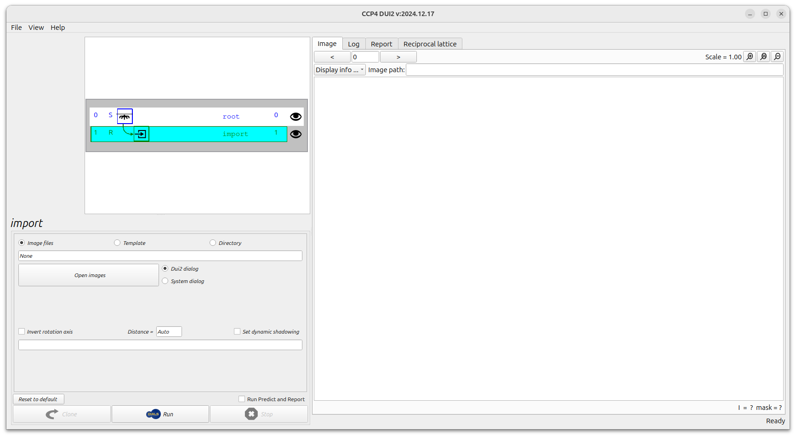
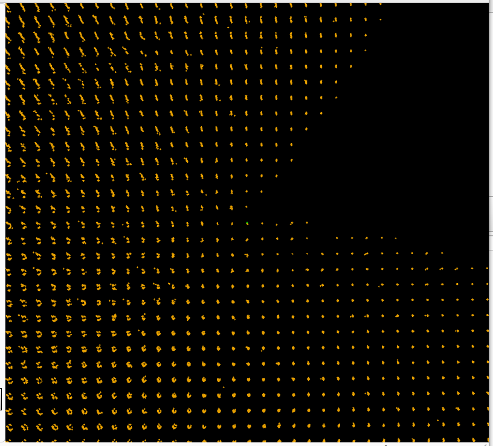
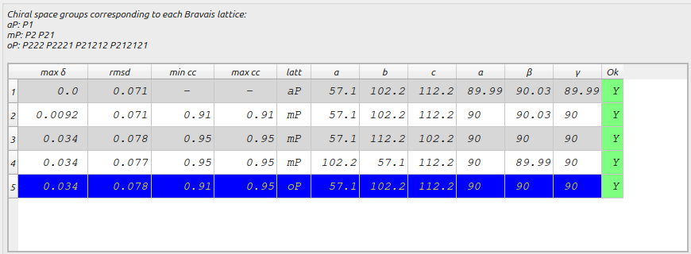
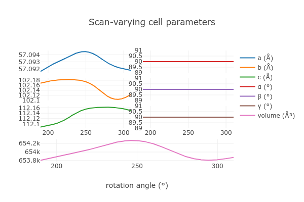
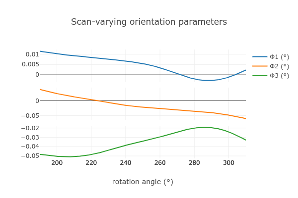

# Data processing tutorial

## Data

To process the data locally using DIALS you will need a copy of the dataset on your computer. If you do not have it already you can download it from [Zenodo](https://zenodo.org/records/14541394/files/zinc_K_edge_data_images_1-800.tar?download=1).

## Summary

We will work on a data set recorded from crystals of the enzyme tetrahydroalstonine synthase (THAS1), with thanks to Prof. Dave Lawson for providing the data set. The images were collected at Diamond Light Source on a PILATUS 6M pixel array detector at an X-ray wavelength of 1.282 Å, at the Zinc _K_ edge. There is sufficient anomalous signal to solve the structure by experimental phasing (SAD). There are some more details about the data set [here](https://zenodo.org/records/14541394)).

First we will set up a xia2 processing job, running remotely on the CCP4 Cloud at Harwell. This will keep your local computer free to simultaneously try out DIALS data processing using the DUI2 graphical user interface.

Once you have completed the interactive processing, you can compare results with the xia2 job. Are there any differences? Which job has better statistics?

## Processing with xia2 on CCP4 Cloud

If you have CCP4 9.0 icons available, double click on the icon named "CCP4Cloud Remote". Alternatively, in a terminal with the CCP4 9.0 environment sourced, run the script `ccp4cloud-remote`. This will open a web browser allowing you to log in to the CCP4 Cloud at Harwell. Here we assume you already have an account, and know how to create a new project.

Within your Cloud project, add a new "Automatic Image Processing with Xia-2" task. Under "Input Data" make sure sure the task will "Look for X-ray images in cloud storage". :file_folder: Browse for the image directory, selecting _Tutorials/Data/1_from_images/ADH4/ADH4_diffraction_data_. Set a sensible project and crystal name, and don't forget to add "Zn" as the heavy atom type!

There's no need to set any advanced options, just select "Run". Make sure the job starts, but after that you can leave it to process while you look at the images locally with DIALS.

> [!WARNING]
> Running xia2 in CCP4 Cloud requires you first to upload the images to Cloud, so it hasn't been a very popular option in the past. You are more likely to come across xia2 from autoprocessing results at the synchrotron, or by running xia2 locally through ccp4i2 or at the command line. Recently however, uploading images was made easier if you (or your lab) use the Globus file transfer platform, where CCP4 Cloud has an endpoint. However, image data is large and will eventually be deleted from Cloud to save space. So don't consider CCP4 Cloud as a backup solution for your diffraction data!

## Setting up processing with DUI

Now we will process the images with DIALS via DUI. While it is possible to start DUI from either ccp4i2 or CCP4 Cloud, _this is not recommended!_ The problem is that when DUI is started from one of the CCP4 GUIs, it is not easy to restart DUI from where you left off if the program exists. If DUI is started from a terminal with the CCP4 environment sourced, then it can manage its own history and pick up from a previously unfinished job.

Opening a command line (terminal) window with the CCP4 environment sourced differs by operating system. Please ask for help if you are unsure how to do this. Once it is done, first change to a directory where you want to do the processing (we recommend processing in a different directory from the images themselves), then start `dui2`. For example, using BASH on Linux or Mac:

```bash
cd ~
mkdir THAS1-dials
cd THAS1-dials
dui2
```

on Windows

```bat
cd %USERPROFILE%
mkdir THAS1-dials
cd THAS1-dials
dui2
```

Once the program starts you should see something like this:



## Importing the images

The first task in data processing with DIALS is to import the images. The DUI history tree is already highlighting an incomplete `dials.import` node. To see some help for a node that hasn't yet been run, click on the "Log" tab on the right, but note this help message is relevant mainly for the usage of `dials.import` from the command line, and some of the description might not be relevant for DUI.

To import the data set, click on the "Open images" button and then navigate to the directory where the images are located. You then need to click on just one of the CBF images, say `ADH4_M7S9_6_0001.cbf`, and then click "Open". DUI will automatically convert that to a template that matches all the images in the data set.

> [!NOTE]
For EIGER data there is not one file per image, but usually a few files with the extension `.h5`. In this case, just select the file with the name that ends `_master.h5`, or, (better) if it is present, the file with the extension `.nxs`.
>

DUI has not actually done the import yet. To do that you need to click on the "Run" button with the DIALS logo, at the bottom of the window. Once that is completed, in the "Log" tab you should see output that looks like this:


```
DIALS (2018) Acta Cryst. D74, 85-97. https://doi.org/10.1107/S2059798317017235
DIALS 3.21
The following parameters have been modified:

input {
  experiments = <image files>
}

--------------------------------------------------------------------------------
  format: <class 'dxtbx.format.FormatCBFMiniPilatusDLS6MSN100.FormatCBFMiniPilatusDLS6MSN100'>
  template: /data/THAS1/images_1-800/ADH4_M7S9_6_####.cbf:1:800
  num images: 800
  sequences:
    still:    0
    sweep:    1
  num stills: 0
--------------------------------------------------------------------------------
Writing experiments to imported.expt
```

This tells you that DIALS interprets the 800 images as a single rotation sweep, and writes the diffraction geometry and associated metadata into a new file, `imported.expt`.

## Viewing the images

Click on the "Image" tab to view the diffraction images using DUI's viewer. You can use the mousewheel to zoom (if you have one), or the magnifying glass buttons at the upper right of the window. Click and drag to scroll the image. More options to change the contrast and colour scheme are contained in the "Display info" pull down menu.

> [!NOTE]
> Look at images at various points in the data set - at the beginning, in the middle, and at the end. Does the crystal diffract well throughout? Are there any other features present alongside the diffraction spots?

## Masking the backstop shadow (optional)

There is a horizontal backstop shadow across the images. We could mask this out if we wanted although in this case the rotation axis orientation is aligned with the backstop shadow (this is not shown in the DUI viewer, but you can see it by running the command `dials.image_viewer imported.expt`). Spots close to the rotation axis are less reliable and will not be integrated anyway (can you figure out why?).

Nevertheless, if you want to try it you can mask out the shadow by clicking the "apply mask" button and then choosing one of the options (I recommend "Polygon") then clicking in the image to define a mask. Be aware that the mask is not actually defined until you click the DIALS "Run" button! After that the masked region will be displayed in translucent red, like this:


## Finding spots

Click the "find spots" button to move to the next step. There are various parameters that can be adjusted to control the spot-finding algorithm. For Pilatus data sets like this one the default parameters are usually sensible. So, just click the "Run" button to start the job.

DIALS finds spots throughout the entire rotation scan, whereas some other programs default to finding spots on just enough images to perform indexing. This means spot-finding takes longer with DIALS, but the information determined from the entire scan can be reused multiple times. In fact, now DIALS will not need to read the image data again until integration. At the end of the spot-finding procedure, in the "Log" tab you will see an ASCII-art histogram indicating the number of spots found on each image. In this case it is pretty boring because the crystal diffracts consistently well throughout the scan:

```
Histogram of per-image spot count for imageset 0:
307302 spots found on 800 images (max 5525 / bin)
*                                * **** ** * * **  ** *    *
************************************************************
************************************************************
************************************************************
************************************************************
************************************************************
************************************************************
************************************************************
************************************************************
************************************************************
1                         image                          800

--------------------------------------------------------------------------------
Saved 307302 reflections to strong.refl
```

Similar information is available graphically in the "Report" tab. Click on "Analysis of strong reflections" to see the per-image counts. You can also see the details about the experiment geometry by clicking on that heading to expand the box.

## Viewing the reciprocal lattice

DUI does not yet contain its own reciprocal lattice viewer. However it is able to launch `dials.reciprocal_lattice_viewer` for you, from a button in the "Reciprocal lattice" tab. Press that, then take some time to explore the controls in the `dials.reciprocal_lattice_viewer`.

> [!NOTE]
> What does middle-button drag do? Try setting "Max Z" to something small, like 5. What does this show you? Align the view down the rotation axis and then click to increase the Max Z value (Use Alt-click to jump in blocks of 100). Can you see how data collection sweeps out a volume of reciprocal space? Can you align the view in a direction that clearly shows the crystal lattice?

> [!WARNING]
> Sorry, there are bugs in the way buttons are displayed in CCP4's version of `dials.reciprocal_lattice_viewer`. The controls are functional. but the values are hard to read.

The main purpose of the `dials.reciprocal_lattice_viewer` prior to indexing is to look for pathologies that might cause indexing to fail, such as poor diffraction geometry, noisy spots, split spots, ice rings, and so on. In this case the reciprocal space lattice looks very clean, so we would not expect indexing to have any problems. Here is a view with a nicely aligned lattice, suggesting that indexing should not be a problem:




## Indexing

Click the "index" button to set up a `dials.index` job. By default this will find a $P\ 1$ cell, using the 3D FFT algorithm. This is fine for our purposes, but feel free to experiment with the other settings. If a job goes wrong you can always click back to the `find_spots` node on the history tree and start a new "index" job from that point.

It is worth taking a moment to read the output in the "Log" tab once the job completes. The program runs through a few stages:

- Setting up for indexing (calculate `max_cell`, setting resolution limits, mapping spots to reciprocal space and forming the FFT grid)
- Performing the FFT, searching for real space basis vectors and forming candidate solutions (in this case 50)
- Ranking the solutions and choosing the single best
- Performing geometry refinement in macrocycles with increasing resolution. At each stage this:
  - Identifies outliers
  - Parameterises the diffraction geometry
  - Refines this geometry against the observations
  - Increases resolution for the next macrocycle
- Once the resolution limit includes all reflections the final refined model and reflections are written to the files `indexed.expt` and `indexed.expt`

Now we have a crystal model it is worth looking at the reciprocal lattice again, by launching the `dials.reciprocal_lattice_viewer` from the "Reciprocal lattice" tab. The spots are now coloured according to whether they are indexed or not, although in this case almost all spots are indexed.

> [!NOTE]
> Try the "Show reciprocal cell" option. Zoom in and see if you can align the view with one of the reciprocal basis vectors, $a^\star$, $b^\star$ or $c^\star$. Try the toggles between "indexed" and "unindexed", "inliers" and "outliers".

## Determining the Bravais lattice

The initial solution from `dials.index` is triclinic, but the $\alpha$, $\beta$ \nd $\gamma$ angles are very close to 90°. To identify compatible Bravais lattices click on the "refine bravais settings" button and press "Run"

This will enforce the Bravais symmetry of compatible lattices (within some tolerance) and run refinement. The results are printed as a table at the end of the logfile shown in the "Log" tab:

```
Chiral space groups corresponding to each Bravais lattice:
aP: P1
mP: P2 P21
oP: P222 P2221 P21212 P212121
+------------+--------------+--------+--------------+----------+-----------+-------------------------------------------+----------+----------+
|   Solution |   Metric fit |   rmsd | min/max cc   |   #spots | lattice   | unit_cell                                 |   volume | cb_op    |
|------------+--------------+--------+--------------+----------+-----------+-------------------------------------------+----------+----------|
|   *      5 |       0.0338 |  0.078 | 0.904/0.947  |    12000 | oP        | 57.10 102.19 112.16  90.00  90.00  90.00  |   654423 | a,b,c    |
|   *      4 |       0.0338 |  0.078 | 0.947/0.947  |    12000 | mP        | 102.18  57.10 112.16  90.00  89.99  90.00 |   654379 | -b,-a,-c |
|   *      3 |       0.0336 |  0.078 | 0.947/0.947  |    12000 | mP        | 57.10 112.16 102.19  90.00  90.00  90.00  |   654411 | -a,-c,-b |
|   *      2 |       0.0083 |  0.071 | 0.904/0.904  |    12000 | mP        | 57.11 102.19 112.18  90.00  89.97  90.00  |   654619 | a,b,c    |
|   *      1 |       0      |  0.071 | -/-          |    12000 | aP        | 57.11 102.19 112.18  89.99  89.97  90.01  |   654702 | a,b,c    |
+------------+--------------+--------+--------------+----------+-----------+-------------------------------------------+----------+----------+
```

However, within DUI it is easier to see this table in the next step - reindexing. So click on the "reindex" button, and the input pane now shows the same information as the text table, with a recommended solution highlighted.



The decision of which solution to choose is down to the user, but solutions deemed acceptable are marked with a "Y" in the "Ok" column. In general, we look for the highest symmetry solution with reasonable values for the `Metric fit`, `rmsd` and `min/max cc` columns. Here we will take solution 5, the primitive orthorhombic (`oP`) one. So ensure that row is highlighted and then press "Run".

You could now check the crystal model under "Experiments" in the "Report" tab to see that the space group has been set to P\ 2\ 2\ 2$. No attempt has been made yet to locate screw axes. That's not a problem, we do not need to know the exact space group prior to integration, just a sub group. There will be another attempt at symmetry determination later.

## Refining the solution

We did some refinement during indexing, and again during Bravais lattice determination. Nevertheless, it is still worth running an additional step of refinement using the program `dials.refine`. This will use a more sophisticated outlier rejection algorithm than before, and it will also refine a "scan-varying" model of the crystal, in which changes to the orientation and unit cell are allowed as a function of the position in the rotation scan. So, click on the "Refine" button and click "Run"

From the log you should see that initially 13 parameters are refined during the "scan-static" macrocycle. Then this is followed by a "scan-varying" macrocycle using 37 parameters, where the crystal parameters have been made local to regions of the scan and the model is constructed by smoothing between these points. This more sophisticated model is able to fit the predictions to the data better, and you should see lower RMSDs as a result. For example:

```
RMSDs by experiment:
+-------+--------+----------+----------+------------+
|   Exp |   Nref |   RMSD_X |   RMSD_Y |     RMSD_Z |
|    id |        |     (px) |     (px) |   (images) |
|-------+--------+----------+----------+------------|
|     0 | 254417 |   0.2914 |  0.28382 |     0.1768 |
+-------+--------+----------+----------+------------+
```


It useful to look at the way the crystal parameters change during the scan, to make sure there are no unrealistic-looking changes. Click on the "Report" tab and expand the "Analysis of scan-varying crystal model". You should see plots like these:





> [!NOTE]
> Check that the change in unit cell parameters and orientation angles looks small across the whole scan.

## Integration

We now have a model for how the data set evolves over the whole scan. We are ready to take this to integrate every spot, including the weak ones that were not found during spot-finding. Integration is the most resource-intensive part of processing and takes the longest. After starting this job, maybe now is a good time to go check on the progress of the xia2 job running on CCP4 Cloud.

```bash
dials.integrate refined.expt refined.refl
```

After predicting reflections, `dials.integrate` starts forming a model to determine how big the measurement boxes should be. This is printed to the log at the lines

```
Calculating E.S.D Beam Divergence.
Calculating E.S.D Reflecting Range (mosaicity).
 sigma b: 0.041727 degrees
 sigma m: 0.062834 degrees
```

The `sigma m` value is the standard deviation of the reflecting range of reflections, which is sometimes (and inaccurately) called "mosacicity". It is good to check that this value is not too high. Here it is significantly less than 0.1°, so the sample seems very well behaved.

After this step, `dials.integrate` will split the processing over as many processors as you have available, first modelling reflection profiles, and then performing the actual integration, using both summation integration and profile fitting methods. There are some summary tables at the end of the log file that are worth a glance, but really we don't have a good idea of the quality of the data set until we do scaling.

## Determining the crystal symmetry

Now we have integrated reflections we have much more useful data to perform symmetry checks. The program `dials.symmetry` will first check the Laue group (and we hope that this indicates our earlier choice of Bravais lattice is confirmed). Then it will look for potential screw axes by looking for apparent systematic absences:

```bash
dials.symmetry integrated.expt integrated.refl
```

This systematic absence information is written to a table:

```
+--------------+---------+---------------+--------------+---------------+--------------+-------------------+------------------+
| Screw axis   |   Score |   No. present |   No. absent |   <I> present |   <I> absent |   <I/sig> present |   <I/sig> absent |
|--------------+---------+---------------+--------------+---------------+--------------+-------------------+------------------|
| 21a          |       0 |            10 |           10 |       1253.16 |      340.318 |            35.204 |           17.228 |
| 21b          |       1 |            30 |           30 |       1575.34 |        1.901 |            45.998 |            0.318 |
| 21c          |       1 |            38 |           39 |       1167.44 |        3.281 |            74.032 |            1.487 |
+--------------+---------+---------------+--------------+---------------+--------------+-------------------+------------------+
```

Here we see clear screw axes along $b$ and $c$, which have high average intensity and $I/\sigma$ for reflections that are expected to be present, but low values for absences. For the potential axis along $a$, while there is higher intensity and $I/\sigma$ for expected present reflections compared to absences, the intensity in the putative absences is actually rather high. This indicates that the a screw axis along $a$ is not supported by the data. As a result, `dials.symmetry` ultimately writes the files `symmetrized.expt` and `symmetrized.refl`, using the space group $P\ 2\ 2_1\ 2_1$

## Scaling and exporting

The scaling program, `dials.scale`, uses algorithms similar to Aimless to fit a physically-interpretable scaling model to the data set. This consists of three components:

- an overall rotation angle-dependent scale factor (accounting for beam intensity changes, variation in illuminated volume and similar effects)
- a relative B-factor decay term (accounting roughly for the loss of high resolution reflections caused by radiation damage)
- an absorption surface (accounting for absorption along the differing path lengths of scattered rays through the crystal volume)

The parameters of these components are adjusted in order to minimise the differences between reflections and their symmetry mates (which ought to have the same intensity). While performing this fit, an error model is also optimised so that the errors associated with the merged intensity for each reflection group is appropriate. We run the program with default options:

```bash
dials.scale symmetrized.expt symmetrized.refl
```

At the end of the job a standard table of merging statistics is printed, parts of which may be familiar to you from "Table 1" of crystallographic structure papers:
```
            -------------Summary of merging statistics--------------

                                             Overall    Low     High
High resolution limit                           1.26    3.42    1.26
Low resolution limit                          112.16  112.61    1.28
Completeness                                   82.6    97.7     5.8
Multiplicity                                    3.8     4.3     1.0
I/sigma                                        15.0    44.2     0.8
Rmerge(I)                                     0.066   0.050   0.625
Rmerge(I+/-)                                  0.054   0.043   1.675
Rmeas(I)                                      0.075   0.056   0.884
Rmeas(I+/-)                                   0.068   0.053   2.369
Rpim(I)                                       0.034   0.026   0.625
Rpim(I+/-)                                    0.041   0.031   1.675
CC half                                       0.997   0.995   0.370
Anomalous completeness                         69.8    91.7     0.1
Anomalous multiplicity                          2.1     2.4     1.0
Anomalous correlation                         0.131   0.074   0.000
Anomalous slope                               1.124
dF/F                                          0.071
dI/s(dI)                                      1.255
Total observations                           561027   39438     526
Total unique                                 145885    9107     507
```

> [!NOTE]
> Do the summary statistics look okay? Is there any sign of an anomalous signal?

While the summary table is worth a quick glance, graphical representations of the merging statistics are usually more informative. You can see plots of values against resolution and against image number if you open the file `dials.scale.html` in a web browser.

> [!NOTE]
> Open `dials.scale.html` and look at the plots. What is the main factor determining the usable resolution limit in this case? How does the anomalous signal look?

Although `dials.scale` reports the _merging statistics_, the data set has not actually been merged (meaning only a single record for each unique Miller index is kept). To export a merged MTZ for structure solution we could use:

```bash
dials.merge scaled.expt scaled.refl
```

however, in this case we prefer to export the scaled, unmerged data then perform merging inside CCP4 Cloud, so that we also get the merging statistics recorded there. To do that:

```bash
dials.export scaled.expt scaled.refl
```

produces the file `scaled.mtz`, which we can import into CCP4 Cloud.

## Comparing results with xia2

Hopefully by now the xia2 job you started on CCP4 Cloud will have finished. Following that job, run a "Merging and Scaling with Aimless" job, where under "Basic Options" select "no scaling only merge". Leave everything else as default and run.

Now import your `scaled.mtz` from DIALS processing, and also follow that with a "no scaling only merge" Aimless job.

Once both jobs have finished you can open both results windows to compare results side-by-side. Navigate to the "Scaling and merging" section in each case to compare merging statistics from Aimless.

Which job looks better, yours or xia2's? Or does it not matter?
